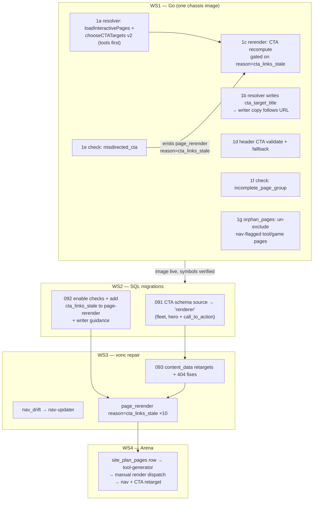

# Plan: Fleet-generic link/flow integrity + vonc.com repair + Arena build

## Context

vonc.com ("Spark", site_id `9ec3b9ee-5b08-461b-b4f8-9e1e03579c74`) is broken in two owner-flagged ways: CTAs whose copy promises one destination but link another ("Enter the Gauntlet" → `/contact.html`), and copy that names destinations that don't exist ("the Arena"). The owner wants this fixed **generically** — any domain with incomplete multipage tools or misdirected links gets caught and repaired by the platform, not by hand.

Root cause (verified in this repo, 2026-07-14): `hero`/`call_to_action` URL fields carry `"source": "pages.contact"` / `"pages.services"` in `content_components.input_schema`. The source resolver (`plan_sections_action.go:420`, `case "pages"`) is a literal name→URL lookup against the `pages` table (`ensurePages`, line 130) with zero copy-awareness; when the page *exists* (contact does), the URL is written into `resolvedData` unconditionally (line ~1197–1201). On the light rerender path (`rerender_page_sections_action.go`), `planSection` re-runs this resolver and `plan.ResolvedData` is merged **last** — over stored `content_data` (line 236–243) — so no data edit can ever win. This is why migration 089's Gauntlet retarget silently reverted. Fleet impact: 75/75 `call-to-action` + 68/69 `hero` instances across 8/10 sites → `/contact.html`.

The existing mitigation, `resolve_internal_links_action.go`, is confirmed crippled three ways: it only runs on full content-writer rebuilds (wired `build_render_context → resolve_links → select_sections → process_sections_loop`, per `docs/agent_docs/docs024_key_docs_latest/content_quality_and_internal_linking/page_content_writer_link_resolver_wiring.sql`); `loadContentHubs` only selects `page_type='section-index'` so a tool/game page can never be a CTA target; and on a miss `setCTAField` leaves the schema-sourced phantom in place (it does emit an `unresolved_cta` review item, but the bad URL still deploys). No discovery check sees any of this: `phantom_internal_links` is registered but enabled on no agent, and it only catches hrefs with *no* page behind them — a CTA landing on a real-but-wrong page passes.

vonc concrete defects: 19 misdirected CTAs across 10 pages; 2 true 404s on `/about.html` (`/how-it-works`, `/how-it-works/the-gauntlet`); 1 circular CTA ("Enter today's Arena" → `/index.html`); both tool pages (`in_header=true`) absent from `site_nav_items`. Gauntlet and Quiz are real deployed tools; **"Arena" has no page anywhere** — a v3-deferred concept that leaked into copy as a destination.

Owner decisions (2026-07-14): full generalized fix (checks + root cause + vonc repair), fix-and-broaden the existing resolver (not a new query-verb source), and **build Arena as a real page/tool**.

## Shape of the change

Why the order is load-bearing: 091 must land before any vonc rerender (otherwise `planSection` re-writes `/contact.html` from schema and wins the merge); 1c must be in the running image before the WS3 rerenders (its recompute is what overwrites the stale stored `content_data`); 092's `check_rerender_mode` OR-branch must exist before dispatching `reason: cta_links_stale` items (else they fall through to assemble-only and change nothing).

## Verified mechanics to reuse (do not reinvent)

- **Discovery checks**: one self-registering file each in `platform/orchestration/actions/discovery_checks/` (`func init() { Register(...) }`); the named import at `platform/orchestration/actions/discovery_checks.go:21` fires every `init()` — no import edits. The runner parses `config.checks` and `logger.Warn`s + skips unregistered names (`discovery_checks.go:121–127`), so SQL can land before the image. Enable via `agent_definitions.default_config → {workflow,steps,run_checks,config,checks}`.
- **Link helpers**: `platform/orchestration/datahelpers/links.go` — `ExtractHrefs`, `ClassifyLinkScope`, `NormalizePagePath`, `PageURLSet`. All new link logic must use these (shared with deploy gate + phantom check). Note `ExtractHrefs` is regex on `href="..."` only — it drops anchor text; the new checks need an extended extractor (below).
- **Work items**: checks return `WorkItemSpec` (`discovery_checks/registry.go:56`) → `insertWorkItem` (item_key dedup, two-strike rule) → `build-dispatch-loop` dispatches via `handler_agent`. Discovery is manual-trigger: `scripts/initial_messages/170_work_item_flow_build/075_trigger_discovery.sh <domain> completeness` (improvement scheduler off since 2026-05-02).
- **Same-package reuse**: `resolve_internal_links_action.go`, `rerender_page_sections_action.go`, `render_site_components_action.go` are all `package actions` — `chooseCTATargets`/`loadContentHubs`/`ctaFieldNames`/`setCTAField`/`loadResolverPageSet` are directly callable across them.
- **Live workflow configs** (mirror these shapes in 092): page-rerender's conditional is `"input_data.spec.reason == ''image_landed'' OR input_data.spec.reason == ''section_data_resolved''"` (`docs/agent_docs/sql_for_agents/034_page_rerender_agent.sql:183`); the writer's `resolve_links` wiring precedent is `page_content_writer_link_resolver_wiring.sql`.
- **Migration convention** (090 precedent): numbered SQL in `docs/social001_vonc_tiktok_social/minilobby_task/` (next: 091), header comment (root cause, blast radius, reversal), `BEGIN/COMMIT`, `CREATE TABLE _backup_... AS SELECT`, `jsonb_set` touching only `source`, live `content_data` repair, `DO $$` verification block that hard-fails.
- **Tool creation** (Gauntlet-class, zero bespoke Go): `tool-generator` → `create_tool_component_action.go` (LLM widget, `component_level='tool'`, tool-doc sentinel header). Known gaps: **TP-002** (never enqueues final render — dispatch manually, 083/084-style scripts in `scripts/initial_messages/210_vonc_trigger/`), **TP-004** (`reconcile_site_plan` tool route commented out — don't rely on it), **TL-001** (generic full page rebuild clobbers the widget row — future edits via section-editor targeted path only).
- **Landmines**: vonc `provocation-card`/`lobby-grid` are deliberate runtime-fill shells — blank `content_data` is correct, LEAVE ALONE (detect by `data-runtime-fill` contract, never by name). After any vonc `reconcile_site_plan`, park the re-emitted `needs_page:provocation` item back to `detected`. Deploy: bump IMAGE_TAG (makefile line 16), verify symbols in pod via `grep -ac <symbol> /proc/1/exe`, image before seeds, no orchestration within ~5 min of pod start. Branch `085_debug_and_feature_loops`, forward-only. Verify by artifact, never by item status.

---

## Workstream 1 — Root-cause fix (Go, one chassis image)

### 1a. Broaden `chooseCTATargets` to interactive pages
`resolve_internal_links_action.go`:
- Add `Title` to the `contentHub` struct; add `loadInteractivePages` (mirror `loadContentHubs`): `SELECT name, COALESCE(title, name), url, COALESCE(nav_order, 100) FROM pages WHERE site_id=$1 AND page_type IN ('tool','game') AND status IN ('active','deployed')`.
- Ranking v2 in `chooseCTATargets`: interactive pages first (by nav_order, then name), then `section-index` hubs; keep `areasExcludedFromCTA` filtering and self-exclusion. Change the return type to `(primary, secondary contentHub)` (zero-value = none) so callers get URL **and** title; update the two existing call sites (`ResolveInternalLinksAction` line 119, plus 1c/1d below).
- Result on vonc: primary → Gauntlet, secondary → Quiz. Sites without tools/games: identical behavior to today.

### 1b. Copy–destination coherence
The resolver runs *before* copy generation, so make copy follow the URL: when `setCTAField` writes a URL, also write `cta_target_title` (target's title) into the same `resolved_data`. The `page-content-writer` guidance change (CTA text written *for* `cta_target_title`) is agent-config SQL in 092, not Go. Guard against the known "prompt seams dropping spec intent" trap — after 092, verify the guidance text actually appears in a live writer prompt (writer prompt log or `llm_guidance` echo).

### 1c. CTA recompute on rerender — the repair path for deployed pages
`rerender_page_sections_action.go`, in the per-section loop (after `planSection`, ~line 215):
- **Gate strictly on `reason == "cta_links_stale"`** (`reason` already extracted at line 123). `image_landed`/`section_data_resolved` rerenders must behave byte-identically to today.
- If gated on and the section's component function is in `ctaFieldNames`: run `loadContentHubs` + `loadInteractivePages` + `chooseCTATargets` (compute once per page, not per section) and write the URL + `cta_target_title` into `plan.ResolvedData` — it's merged last, so it beats the stale stored `content_data`. (After 091, `planSection` no longer emits CTA URLs, so without this write the stale stored value would persist.)
- **Exception rule — do not clobber authored links**: before overwriting a field, check the section's *stored* `content_data` value for it. Keep it if it resolves to a real page (`loadResolverPageSet` → `PageURLSet.Contains`) AND is not an excluded destination. Only replace values that are phantom, empty, self-referential (== the page's own URL), or excluded.
- New helper `ctaExcludedDestination(url string) bool` in `resolve_internal_links_action.go`: `firstPathSegment` returns `""` for top-level pages (`/contact.html`), so it cannot express "lands on contact". Implement as: `NormalizePagePath(url)`, trim leading `/`, strip a `.html` suffix, take the first path segment, test against `areasExcludedFromCTA`. Reuse it in `chooseCTATargets`'s area filter too so the two agree.
- Reason plumbing: `create_rerender_items_action.go:89` only stamps `spec.reason` when `component_id` is present. Add: stamp `spec["reason"] = reason` whenever `reason == "cta_links_stale"`, with no component scoping (the recompute is cheap and page-scoped) — this makes site-wide CTA repair via `rerender-pages` work.

### 1d. Header CTA validation (small hardening)
`render_site_components_action.go` (~142–158): `ctaURL` is currently "the footer nav item labelled Contact". Validate it against `loadResolverPageSet`; if empty or phantom, fall back to `chooseCTATargets` (hubs + interactive). The 3 header components with `pages.contact` schema source are all `is_active=false` — no schema migration needed for them.

### 1e. New discovery check: `misdirected_cta`
New file `discovery_checks/check_misdirected_cta.go` (template: `check_phantom_internal_links.go`). Add `ExtractAnchors(html) []struct{Text, Href string}` to `datahelpers/links.go` (`ExtractHrefs` drops the text; keep it regex-based and dependency-free like the existing helper — match `<a ... href="...">text</a>`, strip inner tags/whitespace). Scan deployed `page_components.rendered_html` (same query shape as the phantom check). Two deterministic findings:
- **`misdirected_cta`**: anchor text token-matches a real page's name/title/nav_label (normalize case, strip stopwords; prefer `tool`/`game` matches) but the href normalizes to a *different* page. Emit **one `page_rerender` work item per affected page** (not per CTA — avoids double-dispatching the same page), `handler_agent: page-rerender`, spec `{reason: "cta_links_stale", findings: [{slot, text, href, suggested_target}...]}`, `item_key: misdirected_cta:<page>:<site>`.
- **`cta_names_unknown_destination`**: anchor text names no real page AND the href is excluded (`ctaExcludedDestination`), self-referential, or phantom → `needs_human_review` (the Arena case: a product decision, not auto-fixable). `item_key` on page+href+text.
  Token-matcher false-positive guard: require ≥1 non-stopword token overlap with a page name/title AND that the matched page ≠ href target; generic texts ("Learn More", "Get Started") match nothing and are skipped.

### 1f. New discovery check: `incomplete_page_group`
New file `discovery_checks/check_incomplete_page_group.go`. For each `parent_section` group in the current `site_plan_pages` (plus `page_type IN ('tool','game')` rows as an implicit "interactive" group), if ≥1 sibling is realised/deployed and ≥1 is missing/`planned`/stale (reuse `decideEmit` logic from `reconcile_site_plan_action.go:293`), emit one finding per gap: `needs_page` → `page-build-handler` for ordinary content roles; `needs_human_review` for `tool`/`game` roles (TP-004: the generic builder would produce a widget-less prose page). No overlap with the existing `missing_tools` check (that's a periodic tool-*evaluation* trigger, not a plan-gap detector). Respect rule 3 of `PLAN_generalise_fixes_to_fleet.md`: where the check declines to emit (runtime-fill, pending rebuild), emit a Finding, not silence.

### 1g. Fix `orphan_pages` tool exclusion (now definite, not conditional)
`discovery_checks/check_orphan_pages.go:201` excludes `page_type='tool'` outright, so vonc's `in_header=true` tool pages can **never** be flagged as `nav_drift`. Change the predicate so nav-flagged pages are always considered:
`AND (COALESCE(p.page_type,'content') NOT IN ('blog-index','tool') OR COALESCE(p.in_header,false) OR COALESCE(p.in_footer,false))`.
Un-flagged tool pages stay excluded (may be linked from JS — the original rationale holds).

**Tests**: unit tests (existing conventions, e.g. `check_tool_acceptance_test.go`) for `ExtractAnchors`, the token matcher, `chooseCTATargets` v2 ranking, `ctaExcludedDestination`, and the 1c exception rule.

---

## Workstream 2 — SQL migrations (after image; `docs/social001_vonc_tiktok_social/minilobby_task/`, 091+)

1. **091 — CTA source flip (fleet)**: on active `hero` + `call_to_action` components, `jsonb_set` the four URL fields' `source` to `"renderer"` (keep `type`, `on_missing: skip_field`, guidance). Verified against the field loop (`plan_sections_action.go:1186–1201`): a `"renderer"` source (like an absent one) resolves to nil → `on_missing: skip_field` omits the field → authored `content_data` and the resolver become the only writers. Backup tables + `DO $$` verification per 090. Safe: only bites on next render, and 1c's exception rule preserves valid authored URLs.
2. **092 — enable + wire**:
    - Append `phantom_internal_links`, `misdirected_cta`, `incomplete_page_group` to `completeness-discovery-agent`'s `run_checks` checks array (idempotent append; backup per the `_completeness_agentdef_backup_20260710` precedent).
    - page-rerender `check_rerender_mode` condition += `OR input_data.spec.reason == ''cta_links_stale''` (exact shape at `034_page_rerender_agent.sql:183`).
    - `page-content-writer` CTA-text guidance tweak (1b): CTA copy must name the destination in `cta_target_title` when present.

---

## Workstream 3 — vonc.com repair (data; after 091 + image, before/independent of Arena)

1. **093 — CTA retargets** (090 pattern: backups + `content_data` updates + `DO $$` verification):
    - 19 misdirected CTAs on 10 pages: hero `cta_url` + call-to-action `primary_cta_url` → `/tools/gauntlet/index.html` where copy names the Gauntlet; keep quiz secondaries.
    - `/about.html`: `content-block-about.cta_url` `/how-it-works` → real page (likely `/archetypes.html` given copy); `platform-comparison.cta_url` `/how-it-works/the-gauntlet` → `/tools/gauntlet/index.html`.
    - "Enter the Arena"/"Enter today's Arena" CTAs → `/tools/arena/index.html` once WS4 lands (Gauntlet interim if Arena slips).
2. **Nav**: trigger discovery — with 1g live, `orphan_pages` emits `nav_drift` for the two tools → dispatch to `nav-updater` (no hand-inserts into `site_nav_items`).
3. Rerender the 10 affected pages (`page_rerender`, `spec.reason: cta_links_stale` — either from the `misdirected_cta` items the discovery run creates, or an 087-style dispatch script), then `curl` every previously-broken CTA target.
4. Do NOT touch `provocation-card`/`lobby-grid` blank fields (runtime-fill shells).

---

## Workstream 4 — Arena (new tool page on vonc)

Platform constraint: no backend/user accounts — Arena v1 is a client-side tool page like Gauntlet (the only supported pattern). Community features (rooms, duels, live votes) stay v3.

1. `site_plan_pages` row (`tool-arena`, role `tool`, current vonc plan) — 088-style SQL.
2. Generate `arena-interface` via `tool-generator`/`create_tool_component` (or an 083/084-style manual dispatch from `scripts/initial_messages/210_vonc_trigger/`). v1 spec from `002e_concept_spark(6).md` Arena Mechanics: today's provocation display, take-filing UI (localStorage), the five Arena Reactions (Genius/Delusional/Suspicious/Based/Cursed) on sample takes, simple remix-chain visual. Reuse `archetype-result-card` pairing if natural.
3. TP-002: manually dispatch the render/deploy item. TL-001: record in running notes that this page must never receive a generic full rebuild.
4. Retarget the 2 Arena CTAs (WS3.1) and let `nav_drift` → `nav-updater` add the nav entry.
5. Owner eyeball before calling it done.

---

## Sequencing

1. WS1 Go → chassis image (bump IMAGE_TAG makefile:16; verify new symbols in pod: `grep -ac chooseCTATargets /proc/1/exe`-style, plus `misdirected_cta`, `incomplete_page_group`) — branch `085_debug_and_feature_loops`.
2. WS2 (091, 092).
3. WS3 (093 + discovery trigger + nav_drift dispatch + rerenders).
4. WS4 Arena.
5. Verification below; update vonc running notes + memory per convention.

## Verification

- **Unit**: `go test ./platform/orchestration/...`.
- **Fleet safety**: after 091, confirm an untouched business site (ai-agent-orchestration `/about.html`) still serves its persisted CTAs with unchanged DB rows (090 verification pattern). Also confirm a plain `image_landed` rerender on any site produces byte-identical CTA hrefs (1c gating proof).
- **vonc end-to-end**: trigger `075_trigger_discovery.sh vonc.com completeness` **before** WS3 → expect `misdirected_cta` (10 page items covering 19 CTAs), `phantom_internal_links` (2), `cta_names_unknown_destination` (Arena), `nav_drift` (2 tools) — proving generic detection on a real broken site. Run WS3/WS4, re-trigger → expect **zero** of those findings (generic loop closed). Park `needs_page:provocation` if reconcile re-emits it.
- **Browser/curl**: every previously-broken vonc CTA resolves 200 to the page its copy names; Gauntlet/Quiz/Arena in rendered nav; Arena page interactive (JS present, tool-doc header, not prose).
- **Regression guard**: new checks run clean (zero findings) on robot-hands.com after its own CTA retarget items are reviewed — no false-positive storm fleet-wide.