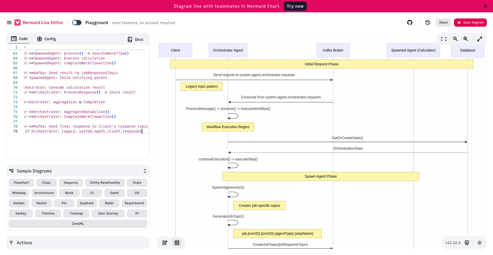

Looking at your codebase, I can see the complexity of the topic management system. Let me create a comprehensive flow diagram showing how topics are created and used throughout the request/response lifecycle, particularly focusing on the transition from legacy to job-specific topics.
Topic Flow and Message Routing Architecture

sequenceDiagram
participant Client
participant Orchestrator as Orchestrator Agent
participant Kafka as Kafka Broker
participant SpawnedAgent as Spawned Agent (Calculator)
participant DB as Database

    Note over Client,DB: Initial Request Phase
    
    Client->>Kafka: Send request to system.agent.orchestrator.requests
    Note right of Client: Legacy topic pattern
    
    Kafka->>Orchestrator: Consume from system.agent.orchestrator.requests
    Orchestrator->>Orchestrator: ProcessMessage() -> process() -> executeWorkflow()
    
    Note over Orchestrator: Workflow Execution Begins
    
    Orchestrator->>DB: GetOrCreateState()
    DB-->>Orchestrator: OrchestrationState
    
    Orchestrator->>Orchestrator: continueExecution() -> executeStep()
    
    Note over Orchestrator,SpawnedAgent: Spawn Agent Phase
    
    Orchestrator->>Orchestrator: SpawnAgentAction()
    Note right of Orchestrator: Creates job-specific topics
    
    Orchestrator->>Orchestrator: GenerateJobTopic()
    Note right of Orchestrator: job.{corrID}.{orchID}.{agentType}.{stepName}
    
    Orchestrator->>Kafka: CreateJobTopic(jobRequestsTopic)
    Orchestrator->>Kafka: CreateJobTopic(jobResponsesTopic)
    
    Orchestrator->>DB: createAgentInDBFromDefinition()
    
    Orchestrator->>Orchestrator: spawnAgentKubernetesJob()
    Note right of Orchestrator: K8s Job with JOB_TOPIC env var
    
    Orchestrator->>Kafka: Send spawn message to jobRequestsTopic
    Note right of Orchestrator: With ResponsesTopic = jobResponsesTopic
    
    Kafka->>SpawnedAgent: Consume from jobRequestsTopic
    Note left of SpawnedAgent: Agent listens on JOB_TOPIC
    
    SpawnedAgent->>SpawnedAgent: ProcessMessage() -> "initialize" action
    SpawnedAgent->>SpawnedAgent: SendInitializationResponse()
    
    SpawnedAgent->>Kafka: Send response to jobResponsesTopic
    Note left of SpawnedAgent: Uses ResponsesTopic from request
    
    Kafka->>Orchestrator: Consume response from jobResponsesTopic
    Orchestrator->>Orchestrator: ProcessResponse() -> handleCompleteResponse()
    
    Note over Orchestrator,SpawnedAgent: Call Agent Phase
    
    Orchestrator->>Orchestrator: CallAgentAction()
    Note right of Orchestrator: Finds job_topic from spawn result
    
    Orchestrator->>Kafka: Send calculation request to jobRequestsTopic
    Note right of Orchestrator: With child orchestration ID
    
    Kafka->>SpawnedAgent: Consume calculation request
    SpawnedAgent->>SpawnedAgent: process() -> executeWorkflow()
    SpawnedAgent->>SpawnedAgent: Execute calculation
    SpawnedAgent->>SpawnedAgent: CompleteWorkflowAction()
    
    SpawnedAgent->>Kafka: Send result to jobResponsesTopic
    Note left of SpawnedAgent: Child notifying parent
    
    Kafka->>Orchestrator: Consume calculation result
    Orchestrator->>Orchestrator: ProcessResponse() -> Store result
    
    Note over Orchestrator: Aggregation & Completion
    
    Orchestrator->>Orchestrator: AggregateDataAction()
    Orchestrator->>Orchestrator: CompleteWorkflowAction()
    
    Orchestrator->>Kafka: Send final response to Client's response topic
    Note right of Orchestrator: Legacy: system.agent.client.responses

Key Topic Patterns and Issues
1. Topic Creation Points

LEGACY TOPICS (Pre-created):
├── system.agent.{agentType}.requests
├── system.agent.{agentType}.responses
└── system.agent.generic.responses

JOB-SPECIFIC TOPICS (Dynamic):
├── job.{correlationID}.{orchestrationID}.{agentType}.{stepName}.requests
└── job.{correlationID}.{orchestrationID}.{agentType}.{stepName}.responses

2. Topic Usage by Component
   ComponentCreates TopicsListens OnSends ToOrchestratorJob topics in SpawnAgentAction- system.agent.orchestrator.requests - job.*.responses (for spawned agents)- job.*.requests (to spawned agents) - system.agent.client.responses (final)Spawned AgentNone- JOB_TOPIC (from env var) - job.*.requests- job.*.responses (parent's response topic)ClientNonesystem.agent.client.responsessystem.agent.orchestrator.requests

3. Why Legacy Topics Persist
   Looking at your code, legacy topics remain because:

Bootstrap Communication: Initial client requests need a known endpoint:
// Client doesn't know job topics yet
targetTopic := "system.agent.orchestrator.requests"

Fallback Mechanisms: Multiple places default to legacy patterns:
// In processor.go sendWorkflowResponse()
if responseCtx.ResponsesTopic == "" {
responseCtx.ResponsesTopic = fmt.Sprintf("system.agent.%s.responses",
msgCtx.ExecutionContext.FromAgentType)
}

Agent Discovery: The system assumes agents can be found at predictable topics:
// In call_agent.go
targetTopic := fmt.Sprintf("system.agent.%s.requests", targetAgentType)

4. Migration Challenges
   The main obstacles to full job-topic adoption:

Initial Contact Problem: Clients need to know where to send the first message
Response Topic Discovery: Parents need to know where children will respond
State Recovery: Restarted agents need to find their topics
Backward Compatibility: Existing agents expect legacy patterns

5. Recommended Solution Path
   // Enhanced topic resolution strategy
   func resolveRequestTopic(ctx context.Context, params ActionParams) string {
   // Priority 1: Job-specific topic from spawn
   if jobTopic := findJobTopicFromSpawn(params); jobTopic != "" {
   return jobTopic
   }

   // Priority 2: Check if agent is job-aware
   if agentID := params.CollectedData["target_agent_id"]; agentID != "" {
   if jobTopic := lookupJobTopicInDB(ctx, agentID); jobTopic != "" {
   return jobTopic
   }
   }

   // Priority 3: Legacy fallback
   return fmt.Sprintf("system.agent.%s.requests", targetAgentType)
   }
6. Topic Flow Issues in Your Code

   Inconsistent ResponsesTopic Setting:
   Sometimes set in SpawnAgentAction
   Sometimes derived from sender type
   Sometimes hardcoded as legacy pattern
   Lost Context Between Steps:
   Job topics stored in CollectedData but not always retrieved
   Response topics not consistently propagated
   Race Conditions:
   Topics created after messages sent
   Agents start before topics ready

To fully migrate to job topics, you'd need:

    A topic registry/discovery service
    Consistent topic propagation in ExecutionContext
    Atomic topic creation with agent spawning
    Client libraries that understand job topics

The hybrid approach exists because removing legacy topics would break initial client communication and agent discovery patterns throughout the system.

---
after discussion:

1. Client -> system.bootstrap.requests
2. Orchestrator creates job.{corr}.{orch}.orchestrator.main.{requests/responses}
3. Orchestrator spawns Calculator:
    - Creates job.{corr}.{calcID}.calculator.main.{requests/responses}
    - Spawns K8s job with JOB_TOPIC=job.{corr}.{calcID}.calculator.main.requests
4. Calculator listens on its job topic
5. Orchestrator sends to Calculator's job topic
6. Calculator responds to Orchestrator's job response topic
7. Orchestrator responds to Client on original response topic
---

Summary of Topic Architecture Decisions
We're implementing a clean job-specific topic model where each agent manages its own topics and only knows about its immediate relationships (parent and direct children).
Core Principles

Every agent is an orchestrator - All agents use the generic orchestrator chassis
Encapsulation - Each agent is a black box; parents don't know about grandchildren
No topic discovery - Topics are explicit in messages and state
Clean perspectives - Each agent maintains its own context without contamination
Stateful orchestration - Database state for workflow logic, messages for routing

Topic Structure
Client → system.agent.generic.requests → Orchestrator
Orchestrator creates: job.{corrID}-{orchID}-{agentType}.{requests|responses}
Spawned agents get: job.{corrID}-{agentID}-{stepName}.{requests|responses}

State Structure
type OrchestrationState struct {
OrchestrationID string       // THIS orchestration's ID
ResponsesTopic  string       // Where I send MY responses
RequestsTopic   string       // Where I listen for requests
ParentOrchestrationID string // Who spawned me (context only)
CollectedData   map[string]interface{} // MY workflow data
}
